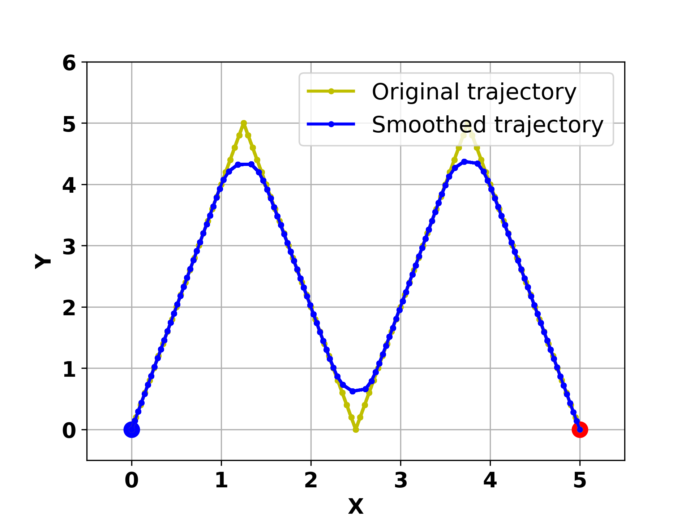
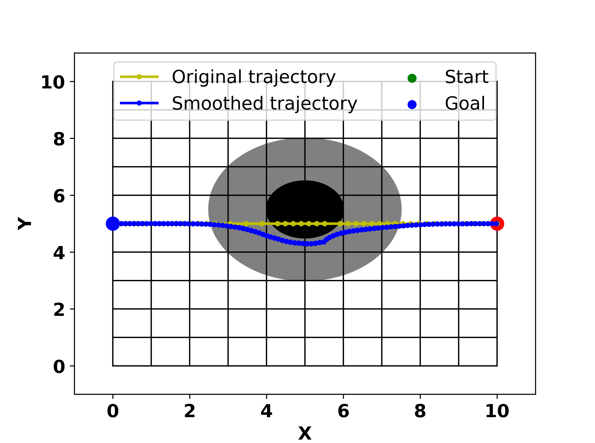
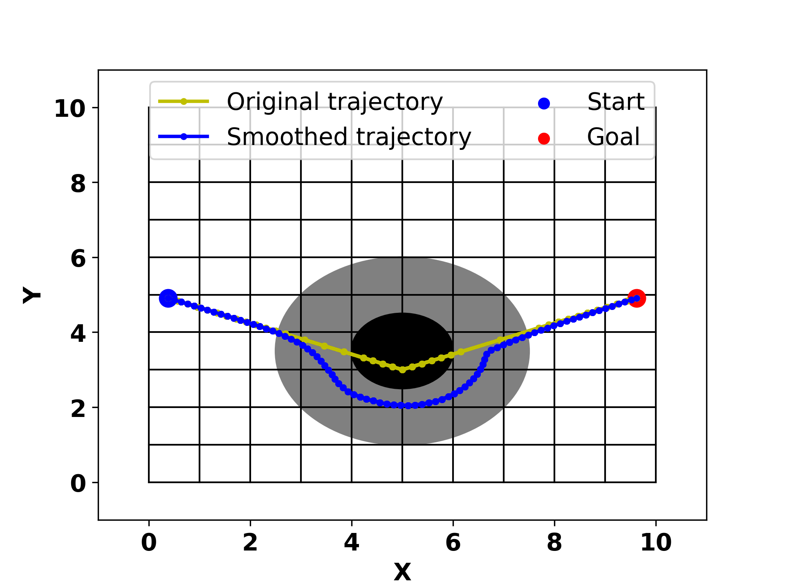
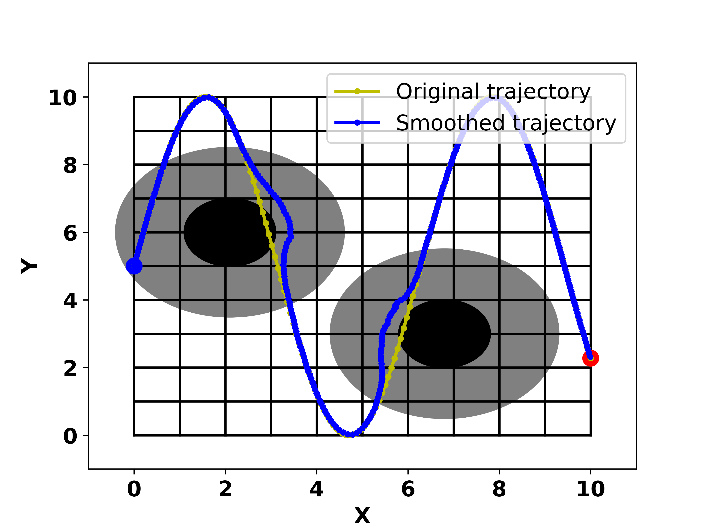

# Real-time Trajectory Smoothing and Obstacle Avoidance：A Method Based on Virtual Force Guidance

In dynamic environments, real-time trajectory planners are required to generate smooth trajectories. However, trajectory planners based on real-time sampling often produce jerky trajectories that necessitate post-processing steps for smoothing. Existing local smoothing methods may result in trajectories that collide with obstacles due to the lack of direct connection between the smoothing process and trajectory optimization. To address this limitation, this paper proposes a novel trajectory smoothing method that considers obstacle constraints in real-time. By introducing virtual attractive forces from original trajectory points and virtual repulsive forces from obstacles, the resultant force guides the generation of smooth trajectories. This approach enables parallel execution with the trajectory planning process and requires low computational overhead. Experimental validation in different scenarios demonstrates that the proposed method not only achieves real-time trajectory smoothing but also effectively avoids obstacles.
## Introduction

This code implements real-time trajectory smoothing and obstacle avoidance, which can be used not only for 
path smoothing of agents like robots but also for filtering and smoothing signal processing. The code 
includes four experiments:

1. The first experiment demonstrates real-time smoothing of a trajectory without obstacles. This can also 
be applied to real-time signal filtering and noise reduction. Relevant code can be found 
in `no-obstacle-smooth.py` or 'experiment1.py'.

2. The second experiment involves a scenario where the planned path is a straight line but passes through 
an obstacle. The algorithm smoothly navigates around the obstacle and converges back to the original 
path. Relevant code is in `1-obstacle-line.py` or 'example2.py'.

3. The third experiment involves smoothing and obstacle avoidance of trajectories with corners, where the obstacle is positioned at the corner. The performance of the algorithm is evaluated for different turning angles. The algorithm smoothly navigates around the obstacle. Relevant code can be found in files 'example3-45.py', 'example3-90.py', and 'example3-135.py'.

4. The four experiment is more complex, where the planned path follows a sine curve and passes through 
two obstacles. One obstacle does not obstruct the path but is within its influence range, while the 
other obstacle blocks the path. The algorithm ignores the first obstacle and smoothly navigates around 
the second one. Relevant code is in `2-obstacle-sin.py`, `example4-1.py` and `example4-2.py`.

5. The remaining file, `basic.py` , contain supporting functions for the code.

## Usage

To use this code, follow these steps:

1. Make sure you have Python installed on your system.
2. Install the required dependencies:

   ```
   pip install math
   pip install matplotlib
   pip install numpy
   ```

3. Run the script.
4. The script will generate visualizations of both the original planned trajectory and the 
smoothed obstacle-avoiding trajectory generated by the algorithm.

## Parameters

The script allows you to adjust various parameters to customize the behavior of the moving 
point and the obstacle avoidance algorithm. These parameters include:

- `kre`: Repulsion factor for obstacles.
- `kat1`, `kat2`, `kat3`: Attraction factors for different points along the trajectory.
- `kre1`, `kre2`, `kre3`: Repulsion factors for different points along the trajectory.
- `step_max`: Maximum step size for the moving point.
- `disErr`: Distance threshold for considering the moving point to have reached a position.

## Results Display
1. `example1.py`:

2. `example2.py`:

3. `example3-135.py`:

4. `2-obstacle-sin.py`:


You can refer to the corresponding paper for detailed content.