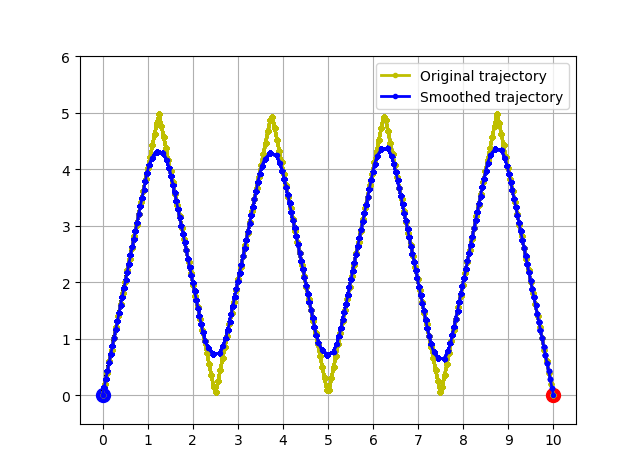
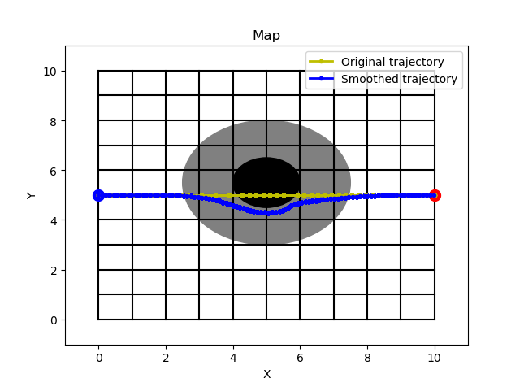
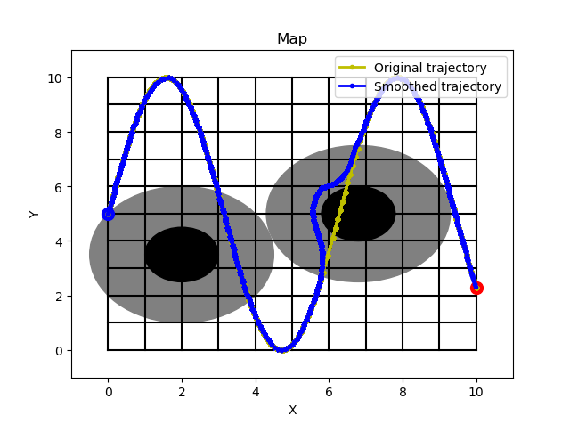

# Real-time Trajectory Smoothing and Obstacle Avoidance with Virtual Force Guidance
This algorithm runs in parallel with a real-time trajectory planner, capable of receiving trajectory points 
generated by the planner and smoothing them while avoiding obstacles. The method employed designs virtual 
forces to guide the generation of smoothed 
trajectories. By adjusting tracking speeds and distances at different time points, the direction of the 
resultant force is determined, thereby generating smooth trajectories. Tuning various parameters within 
this framework is challenging. In the current 
code, the author has tested a set of parameters that work well for the current distribution of obstacles 
to verify the feasibility of our approach. Readers are encouraged to continue researching within this 
framework to find better general-purpose parameters 
and explore their relationships under different circumstances.

## Introduction

This code implements real-time trajectory smoothing and obstacle avoidance, which can be used not only for 
path smoothing of agents like robots but also for filtering and smoothing signal processing. The code 
includes three experiments:

1. The first experiment demonstrates real-time smoothing of a trajectory without obstacles. This can also 
be applied to real-time signal filtering and noise reduction. Relevant code can be found 
in `no-obstacle-smooth.py`.

2. The second experiment involves a scenario where the planned path is a straight line but passes through 
an obstacle. The algorithm smoothly navigates around the obstacle and converges back to the original 
path. Relevant code is in `1-obstacle-line.py`.

3. The third experiment is more complex, where the planned path follows a sine curve and passes through 
two obstacles. One obstacle does not obstruct the path but is within its influence range, while the 
other obstacle blocks the path. The algorithm ignores the first obstacle and smoothly navigates around 
the second one. Relevant code is in `2-obstacle-sin.py`.

4. The remaining two files, `line_circle.py` and `force.py`, contain supporting functions for the code.

## Usage

To use this code, follow these steps:

1. Make sure you have Python installed on your system.
2. Install the required dependencies:

   ```
   pip install math
   pip install matplotlib
   pip install numpy
   ```

3. Run the script `no-obstacle-smooth.py`, `1-obstacle-line.py` and , `2-obstacle-sin.py`.
4. The script will generate visualizations of both the original planned trajectory and the 
smoothed obstacle-avoiding trajectory generated by the algorithm.

## Parameters

The script allows you to adjust various parameters to customize the behavior of the moving 
point and the obstacle avoidance algorithm. These parameters include:

- `kre`: Repulsion factor for obstacles.
- `kat1`, `kat2`, `kat3`: Attraction factors for different points along the trajectory.
- `kre1`, `kre2`, `kre3`: Repulsion factors for different points along the trajectory.
- `step_max`: Maximum step size for the moving point.
- `disErr`: Distance threshold for considering the moving point to have reached a position.

## Results Display
1. `no-obstacle-smooth.py`:

2. `1-obstacle-line.py`:

3. `2-obstacle-sin.py`:

#   S u Y o n g B i n 8 - R e a l - t i m e - T r a j e c t o r y - S m o o t h i n g - a n d - O b s t a c l e - A v o i d a n c e - w i t h - V i r t u a l - F o r c e - G u i d a n c e 
 
 
